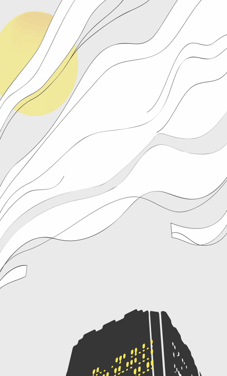
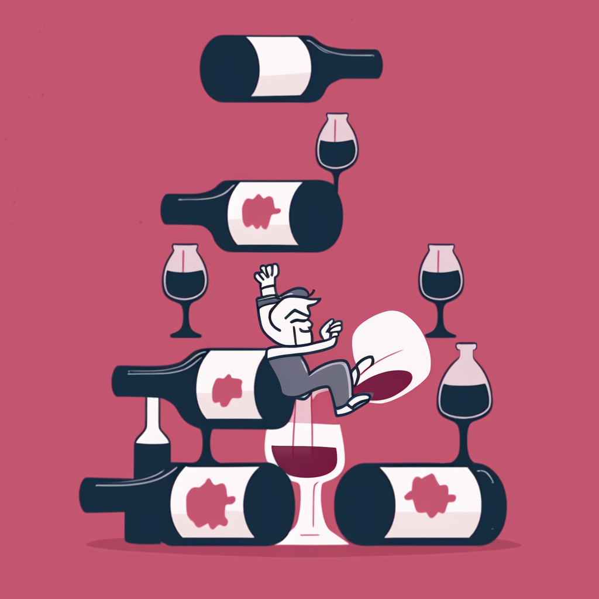
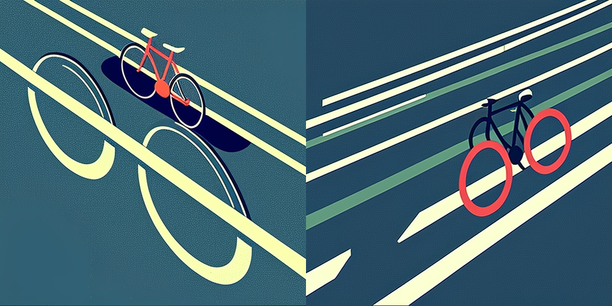

<!-- Include the Typed.js library -->

<!-- HTML element for displaying the text -->

  

<!-- Initialize Typed.js -->

<!-- CSS to ensure the cursor stays inline with the text -->

 
 

<!-- 
Latest Work
 -->

<!-- Grid of Latest Work -->

<!-- :::{.grid}
:::{.g-col-4}

**The Cost of Sunlight**
:::

:::{.g-col-4}

**Cellar Defenders**
:::

:::{.g-col-4}

**Manhattan is the safest place to bike in NYC. What about the rest of New York?**
::: -->

:::{#latest-work}
:::