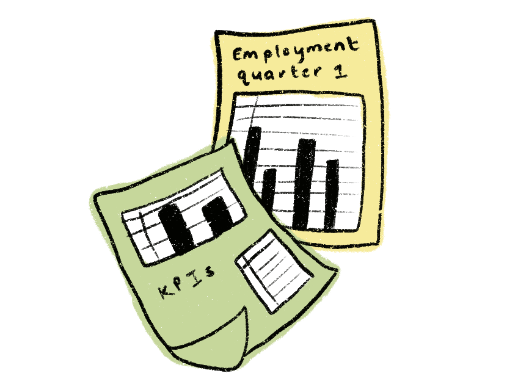
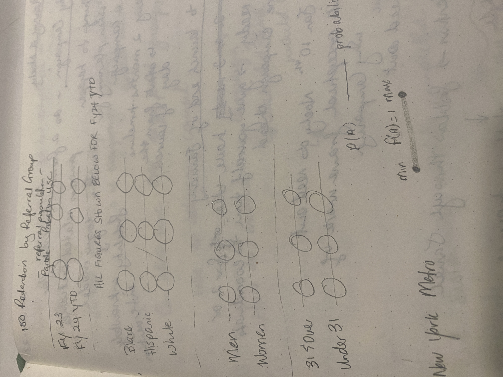
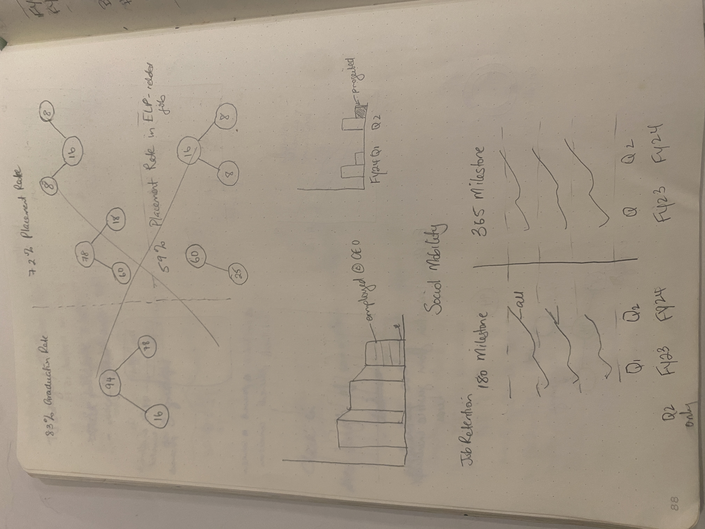
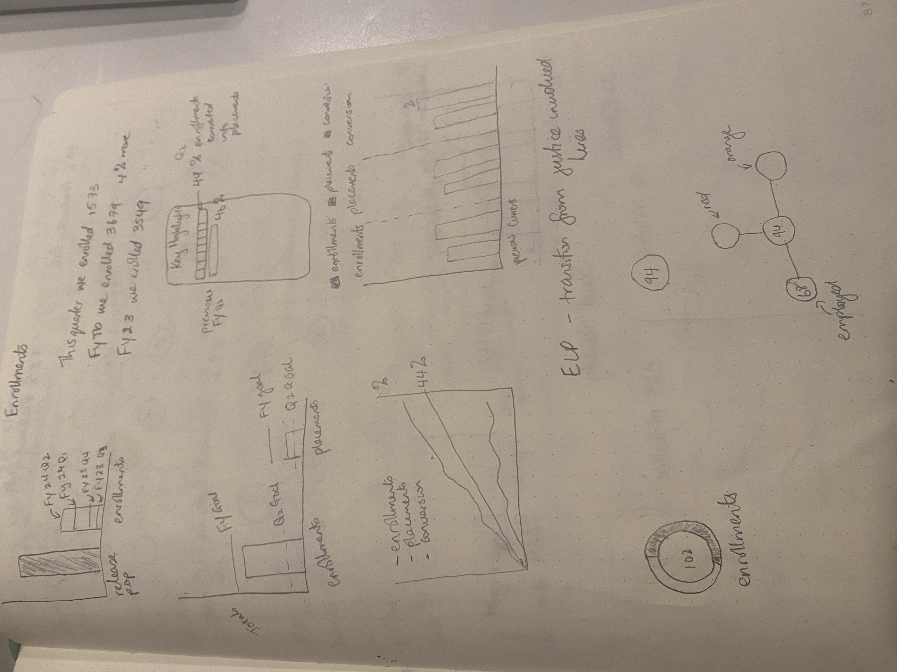
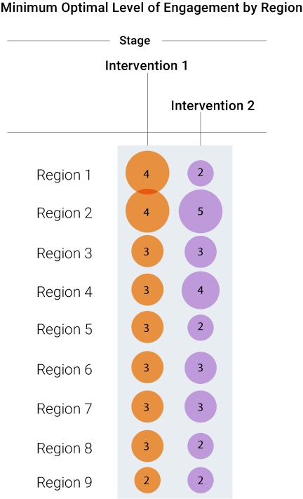

<p class="thumbnail-hide">
  
</p>

## Crafting Visual Narratives for Corporate Strategy

:::{.callout-important appearance="minimal"}
 All data in this case study is anonymized to protect confidentiality. Details have been altered, but the depicted processes and insights are accurately represented.
:::

In my role as the Data Insights Specialist II on the Learning and Impact team at the Center for Employment Opportunities, I directed the overall strategy for each quarterly board report. I identified key performance indicators (KPIs) by analyzing data and aligning them with the strategic goals of the organization. I coordinated the narrative, deciding which insights to present, and shaped the story to highlight our achievements and areas for improvement. I'd communicate these insights through visualizations that were clear and impactful.

Here, I'll share a glimpse into how I'd transform raw data [usually obtained from various departments] into engaging visual stories that inform strategic and operational decisions. It’s all about turning complex data into clear, useful insights, even for those who aren’t familiar with data science or statistical jargon. 
<!-- I’ll share the methods we used to communicate effectively, and the real-world challenges and successes me and the team encountered along the way. -->

Each quarter, I set these goals for myself:


* **Show Org-Wide Performance:** Ensure strategic alignment with fiscal year objectives.
* **Share Our Strategy for Improvement:** Highlight key initiatives and outcomes
* **Delivering Actionable Insights:** Provide clear, impactful information to the board.


## Wrangling the Data

At the end of each quarter, I'd reach out to various departments to gather updates on programs and activities. As the Data Insights Specialist II, I stayed informed on organizational activities year-round, as our team was heavily involved in evaluations and research. Proactivley engaging with pilots, program performance, evaluations, research, and analyses allowed me to know exactly what to ask for when compiling the board report, ensuring relevant insights were included.

**The Data**

Usually, these updates came back to me as rudimentary figures, spreadsheets, or dashboards from which I’d pull data points. I would then download these into .csv files and process them using my favorite tool: pandas.

::: {.grid}
::: {.g-col-4}

:::

::: {.g-col-4}

:::

::: {.g-col-4}

:::

:::


In addition to incorporating relevant program updates, we also included findings from the Learning and Impact team's internal analyses. One quarter, we included insights derived from an evaluation of one of our intervention methods. These insights revealed specific characteristics and intervention dosages that significantly increased the likelihood of success for our participants.

"Likelihood"—there’s a term you'll often hear in data science. Within the Learning and Impact team and in discussions across departments, terms like probabilities and likelihoods were straightforward to discuss, thanks to the context we could provide. However, translating these and other statistical terms accurately into language and visuals for the board—without the benefit of interactive dialogue—posed a unique challenge.

In the **code blocks that follow**, which I've anonymized for confidentiality, I'll demonstrate how I transformed the insights from our intervention analysis into visuals for our board report. The data cleaning, processing, and manipulation steps shown below are routine practices I used to prepare the data points received from various departments. These steps were crucial for converting raw data, whether received through G-chat, Google Sheets, or emails, into clear, impactful board-level visual presentations.

```{python}
# Setting Up Environment
import pandas as pd
import numpy as np
import matplotlib.pyplot as plt
```
```{python}
# Read in Data
df1 = pd.read_csv("anonymized_all.csv")
df2 = pd.read_csv("anonymized_fy24_only.csv")
```
```{python}
def clean_df(df, date_col, drop_col):
    df[date_col] = pd.to_datetime(df[date_col])
    df = df.drop([drop_col], axis = 1)
    df.columns = df.columns.str.lower()
    
    return df

cleaned_df1 = clean_df(df1,'Start Date', 'Client Name')
cleaned_df2 = clean_df(df2,'Start Date', 'Client Name')
```

```{python}
def fiscal_year(date):
    if date.month >=7:
        return date.year + 1
    else:
        return date.year
    
cleaned_df1['fiscal year'] = cleaned_df1['start date'].apply(fiscal_year)
cleaned_df2['fiscal year'] = cleaned_df2['start date'].apply(fiscal_year)
```

```{python}
# Check FYs in dataset
cleaned_df1['fiscal year'].unique()
```

```{python}
cleaned_previous = cleaned_df1[cleaned_df1['fiscal year'].isin([2024])]
# cleaned_previous.head()
```

```{python}
previous_weekly_performance = (
  cleaned_previous
  .groupby(['fiscal year', pd.Grouper(key='start date', freq='W')]).size()
  .reset_index(name = 'previous_weekly_performance')
)
# previous_weekly_performance
```

```{python}
previous_weekly_performance['cumulative_performance'] = (
  previous_weekly_performance
  .groupby('fiscal year')['previous_weekly_performance']
  .cumsum()
)
previous_weekly_performance.head()
```

```{python}
current_weekly_performance = (
  cleaned_df2
  .groupby(['fiscal year', pd.Grouper(key='start date', freq='W')]).size()
  .reset_index(name = 'current_weekly_performance')
)
current_weekly_performance['current_cumulative_performance']= (
  current_weekly_performance
  .groupby('fiscal year')['current_weekly_performance']
  .cumsum()
)
# current_weekly_performance.head()
```

```{python}
merged_df = pd.merge(previous_weekly_performance, current_weekly_performance, how = 'outer')
# merged_df.head()
```

## Designing Clear Visuals
After extensive data manipulation—cleaning, pivoting, and generating initial visuals like bar charts—I begin to see potential ways to make the data understandable for the board.



One best practice I adhere to in my visualization work is the "30-second rule" (sometimes it's more like 2 minutes). The idea is that viewers should quickly grasp the intent of a chart or graph. This contrasts with the more abstract visualizations by my favoured artists like Federica Fragipane and Alberto Cairo, who target a different audience.

For board presentations, I focus on straightforward designs, avoiding overly complex or abstract visuals. Sketching with pencil and paper after extensive screen time helps me connect physically with my work, making the creative process more tangible and refreshing.

::: {layout-ncol=3}






:::


## Final Product
Below are some examples of the final visualizations I have created for corporate board presentations. These visuals are drawn from various projects, each tailored to address specific strategic questions. From demonstrating engagement levels across regions to highlighting the efficacy of strategic efforts over time, these visuals represent the culmination of thorough data analysis and creative design.

::: {.grid}
::: {.g-col-4}

:::

::: {.g-col-8}
<div style="width: 100%; height: 390px; overflow: hidden; position: relative;">
  <iframe title="[ Insert title here ]" aria-label="Interactive line chart" id="datawrapper-chart-NAVAA" 
          src="https://datawrapper.dwcdn.net/NAVAA/1/" scrolling="no" frameborder="0" 
          style="width: 0; min-width: 100% !important; border: none; background: #FFFFFF; height: 410px; position: absolute; top: 0;" 
          height="410" data-external="1"></iframe>
</div>
<script type="text/javascript">!function(){"use strict";window.addEventListener("message",(function(a){if(void 0!==a.data["datawrapper-height"]){var e=document.querySelectorAll("iframe");for(var t in a.data["datawrapper-height"])for(var r=0;r<e.length;r++)if(e[r].contentWindow===a.source){var i=a.data["datawrapper-height"][t]+"px";e[r].style.height=i}}}))}();
</script>

:::
:::

This section not only demonstrates the final output of my visualization processes but also underscores my ability to translate complex data into clear, decision-driving graphics.